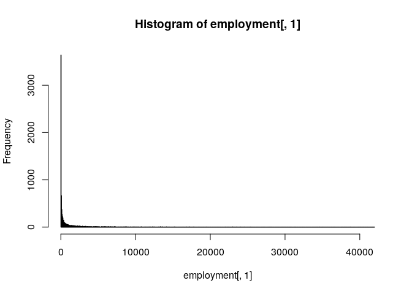
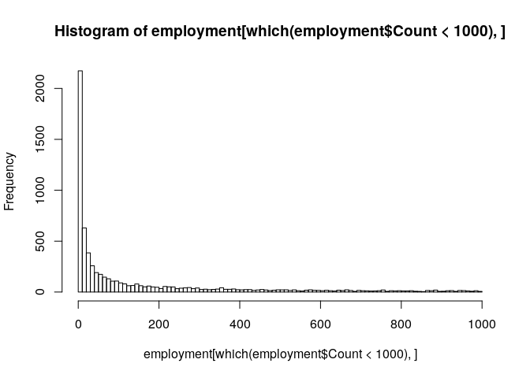
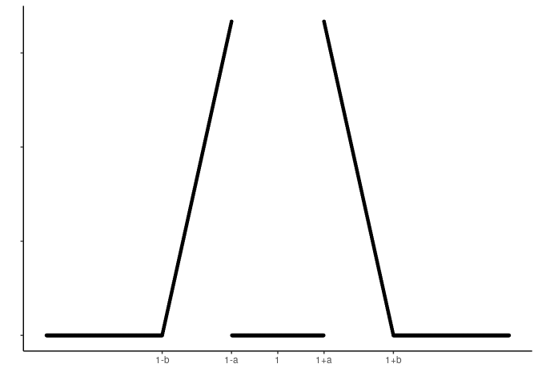
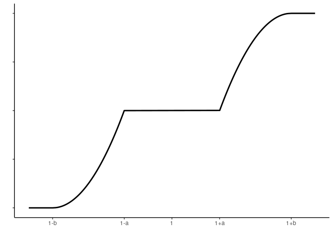
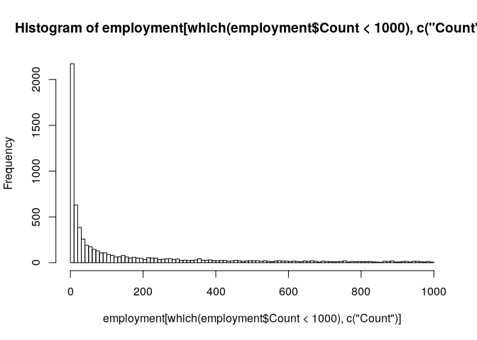
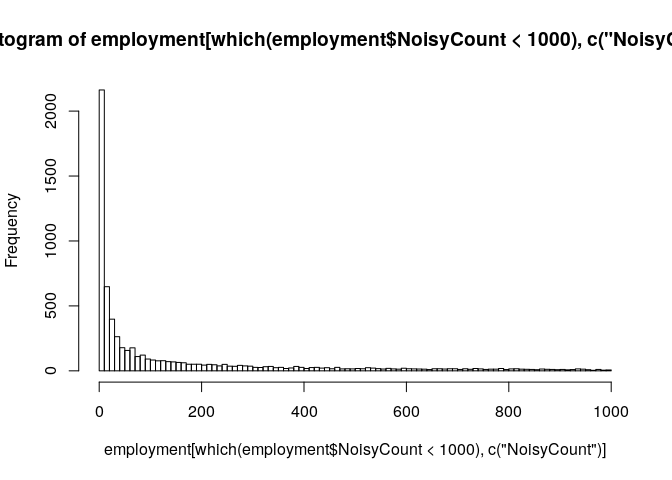

# Multiplicative input noise infusion
Lars Vilhuber  


First proposed by [Evans, Zayatz and Slanta (1998)](http://www.jos.nu/Articles/abstract.asp?article=144537), multiplicative input noise infusion (henceforth simply "noise infusion") is used as a disclosure-avoidance measure. See also [our implementation](https://ideas.repec.org/h/nbr/nberch/0485.html) in the [Quarterly Workforce Indicators](http://lehd.ces.census.gov/data) (published in 2009, but first implemented in 2003).

Let's generate some random data:

```r
employment <- round(as.data.frame(exp(runif(size,log(1),log(42000)))))
names(employment) <- c("Count")
```

This fake employment distribution looks like this (actually, real employment is different):

<!-- -->

or for a closeup:

<!-- -->

but most importantly, it has a \textbf{mean of 3879}, a \textbf{median of 215}, and \textbf{Q25 of 15}.

# Ramp distribution
The most common noise distribution used is a ramp distribution.
So what is a ramp distribution?
$$
	p\left( {\delta _{j}}\right) =\left\{ {{
			\begin{array}{ccl} 
			\dfrac{ {1+ b - \delta } }{\left( {b - a} \right)^2}
					&,&\;\delta \in \mbox{ }\left[ {1+a,1+b} \right] \\ 
				\dfrac{ {\delta - (1 - b)} }{\left( {b - a} \right)^2} 
				&,&\;\delta \in \left[ {1 - b,1 - a} \right] \\ 
				0&,&\;\mbox{ otherwise } \\
				 \end{array}
		}}\right. 
$$
with a cumulative distribution of
$$
		F\left( {\delta _{j}}\right) =\left\{ {{
				\begin{array}{*{20}c}
				{\mbox{0},\;\delta < {2-b} } \\ 
				{{\left[ {\left( {\delta - (1-b)} \right)^2} \right]} 
				  {\left/ {\vphantom {{\left[ {\left( {\delta - (1-b)} \right)^2} \right]} 
				  {\left[ {2\left( {b - a} \right)^2} \right]}}} \right. } {\left[ {2\left( {b - a} \right)^2} \right]},\;\delta \in \left[ {1 - b,1 - a} \right]\mbox{ }} \\
				  {\mbox{0.5}, \;\delta \in \mbox{ }\left( {1-a,1+a} \right)\mbox{ }} \\
				  {\mbox{0.5} + {\left[ {\left( {b - a} \right)^2 - \left( {1+b - \delta } \right)^2} \right]}
				  {\left/ {\vphantom {{\left[ {\left( {b - a} \right)^2 - \left( {1+b - \delta } \right)^2} \right]}
				  {\left[ {2\left( {b - a} \right)^2} \right]}}} \right. } {\left[ {2\left( {b - a} \right)^2} \right]},\;\delta \in \mbox{ }\left[ {1+a,1+b} \right]\mbox{ 
					}} \\ 
					{\mbox{1}, \;\delta > {1+b} } \\ \end{array}}}\right. 
$$
		

```r
dramp <- function(x,a,b) {
  if ( b< a) {
    c <- a
    a <- b
    b <- c
  }
  part1 <- which(x < 1- b )
  part2 <- intersect(which (x >= 1-b),which(x <= 1-a))
  part3 <- intersect(which (x > 1-a), which(x< 1+a))
  part4 <- intersect(which (x >= 1+a),which(x <= 1+b))
  part5 <- which(x > 1+ b )

  y <- x
  y[part1] <- 0
  y[part2] <- (x[part2] - (1-b))/ ( b - a )^2
  y[part3] <- 0
  y[part4] <- ( 1 + b -x[part4])/ ( b - a )^2
  y[part5] <- 0
  return(y)
}

invcramp <- function(y,a,b) {
  part1 <- intersect(which(y>0.5),which(y<=1))
  part2 <- intersect(which(y<=0.5),which(y>=0))
  part3 <- intersect(which(y<0),which(y>1))
  x <- y
  x[part1] <-  1+b - ((1-2*(y[part1]-0.5))*(b-a)^2)^0.5
  x[part2] <-  1-b + ((  2*(y[part2]    ))*(b-a)^2)^0.5
  x[part3] <-  0
  return(x)
  }
```


\noindent where $a={c}/{100}$ and $b={d}/{100}$ are constants chosen
		such that the true value is distorted by a minimum of $c$ percent and a
		maximum of $d$ percent. This produces a random noise factor centered around 1 with
		distortion of at least $c$ and at most $d$ percent.
		
<!-- -->
<!-- -->

# Distorting the data

Applying the multiplicative noise to the counts yields protected counts. Since the mean of the noise distribution is unity by design, the two distributions are likely to have similar means. 

```r
employment$uniform <- runif(nrow(employment))
employment$fuzzfactor <- invcramp(employment$uniform,0.1,0.25)
employment$NoisyCount <- round(employment$Count * employment$fuzzfactor,0)
```

If we compare the original data 

<!-- -->

against the protected data

<!-- -->

we see very similar distributions. The user can verify that the univariate statistics are very similar: the raw data has a mean of 3878.9 against a mean of  3860.2  in the protected data.
